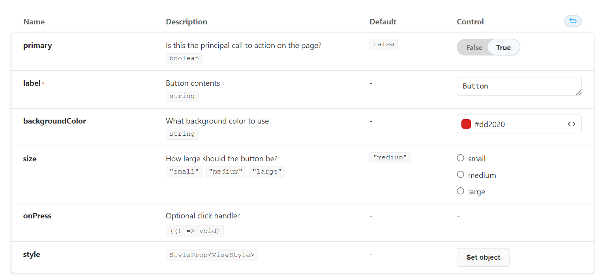

 

# Three Reasons to Use Storybook React Native Web for Your Next Project

I adopted a dog several months ago. A roly-poly Shar Pei mix.  The decision to take him home was easy. Navigating the adoption process was not. The UX of adopting a dog online is haphazard. You find the dog on your pet adoption app, and you send a message to the shelter in the app and leave your phone number. The shelter texts you on your phone to tell you that you can’t visit the dog until you fill out an application. They give you a link to an application on their website. The site is often terrible, due to the shelter’s shoestring budget. If you are considering many dogs, you could go through this process several times, filling out applications that are mostly identical to the previous ones.


I thought it would be much nicer to have this entire process done in-app.  I was looking to dip my toes into mobile development anyway, so why not? Let’s do it.

“Let’s build a cross-platform mobile app!”, exclaims the eager-beaver software engineer.

I chose to use React Native, hoping my previous exposure to Typescript would serve me well. After a story mapping session with a partner, we set out to build our first UI. Yet, I found learning React Native UI to be a clumsy experience. React components are advertised to be the epitome of SOLID principles. They are supposed to be independent, reusable pieces that can be developed in isolation. When developing with an emulator or a phone, components are entangled in business logic, interactive states, and app context. That defeats the purpose of its design.

Fed up with the developer experience I went searching for solutions, and stumbled upon Storybook for React Native Web.

Storybook has been around for a while as a JavaScript UI explorer with special testing and debugging capabilities. For each component, you can write “stories” that will render your component in specific states, served directly to your browser. This allows you to approach a component TDD style. Developers write stories as test cases and regularly check your implementation against them.

Storybook supports React Native, though I found its functionality to be severely lacking. It was missing a lot of core add-ons and functionality that existed for web development.  It was also very difficult to set up due to contrasting architectures.
Then, I stumbled upon the Storybook for React Native Web add-on. With the addon, React Native components use ReactJS configuration, allowing for a more out-of-the-box Storybook experience.

I took time during SEP’s Hackathon to explore this tool, and once I got it working, I discovered several reasons why you would want to consider using Storybook to develop your React Native UI.

## Develop components quickly and easily.

Storybook runs independent of your actual app, in a browser on the localhost. This allows developers to develop UI components without ever plugging in a device or firing up an emulator. Game Changer!


## Develop components in isolation with visual TDD.

Storybook allows developers to focus on a component without getting hung up on extra logic or dependencies.  We can write stories to test multiple component states at the same time. A story is a function that returns a component’s rendered state given a set of arguments. We can create multiple states this way. Below we have a Button story written in a Button.stories.js file to render a primary, secondary, large, and small button.

```
export default {
  title: 'Example/Button',
  component: Button,
  argTypes: {
    backgroundColor: {control: 'color'},
  },
  decorators: [
    Story => (
      <View style={{flex: 1, alignItems: 'flex-start'}}>
        <Story />
      </View>
    ),
  ],
} as ComponentMeta<typeof Button>;

export const Primary = {
  args: {
    primary: true,
    label: 'Button',
  },
};

export const Secondary = {
  args: {
    label: 'Button',
  },
};

export const Large = {
  args: {
    size: 'large',
    label: 'Button',
  },
};

export const Small = {
  args: {
    size: 'small',
    label: 'Button',
  },
};
```

In our Button.tsx file, we can create a Button component like we normally would.

```
export const Button = ({
  primary = false,
  size = 'medium',
  backgroundColor,
  label,
  style,
  onPress,
}: ButtonProps) => {
  const modeStyle = primary ? styles.primary : styles.secondary;
  const textModeStyle = primary ? styles.primaryText : styles.secondaryText;

  const sizeStyle = styles[size];
  const textSizeStyle = textSizeStyles[size];
  return (
    <TouchableHighlight
      underlayColor={primary ? '#1eb1fb' : '#fafafa'}
      style={[
        styles.button,
        modeStyle,
        sizeStyle,
        style,
        !!backgroundColor && {backgroundColor},
      ]}
      onPress={onPress}>
      <Text style={[textModeStyle, textSizeStyle]}>{label}</Text>
    </TouchableHighlight>
  );
};
```

We are able to see all button states rendered in our local storybook for us to visually inspect.

## Storybook serves as a living style guide.

I would like our adoption app to be open source. One of the challenges of open source management is keeping up with documentation. Effective documentation is key to fostering inclusive communities needed to develop code quickly and efficiently with high quality.

Storybook fills this need for us by serving as a living style guide that can deploy to a static site for everyone’s use. This allows anyone to visualize and interact with components without having any of the implementation logic in place. This is helpful in onboarding new developers and preventing duplicate components. It can also facilitate code reviews and discussions with stakeholders.




Once I was able to get a Storybook example working on a React Native project, I was able to quickly hack out a simple clone of the SEP homepage in less than 30 minutes.


You can find the deployed storybook [here](https://sep.github.io/storybook-react-native/?path=/story/screens-home--basic), and the repo here.

There are some caveats to consider when deciding to use Storybook for React Native. Some libraries do not have web support, which means they might not display correctly or render at all as they would on a native device. Some extra configuration might also be needed for libraries that are not transpiled. So far, at least in the case of my project, it seems to fit the bill.


Special thanks to Danny Williams, one of the maintainers of @storybook/react-native and the creator of the React Native Web add-on, for providing an [example repo](https://github.com/dannyhw/addon_react_native_web_example) as a jumping-off point.

If you would like to read more about his add-on and how to get it set up on your project, be sure to visit his [blog post](https://www.dannyhwilliams.co.uk/introducing-react-native-web-storybook)!


